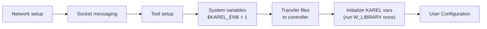
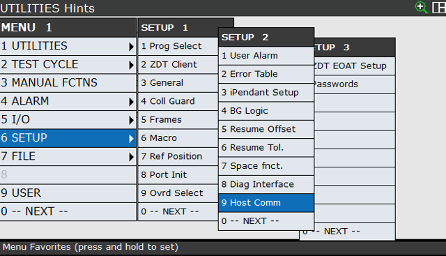
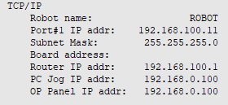
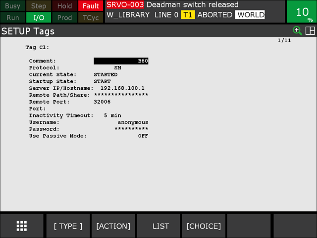
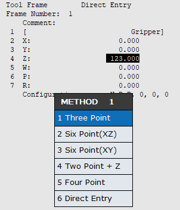
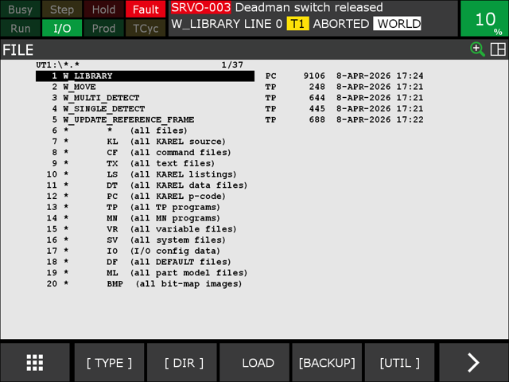

# 1. Installation & Setup

The FANUC robot vision example is a KAREL library (`W_LIBRARY`) together with a set of TP programs. Before running it, prepare the robot controller, the network connection to the Machine Vision Device, and the tool frame.

## Tested configuration

| Component | Value |
| --- | --- |
| Controller | FANUC R-30iB Mate Plus |
| Controller software | V9.40 (use the same version on your controller) |
| Robot arm | LR Mate 200iD |

## Files

The example files are in the [`sources`](https://github.com/wenglor/robot-vision-fanuc/tree/main/sources) directory of this repository:

/// html | div.col-widths
    attrs: {style: "--w1: 35%; --w2: 65%;"}
| File | Description |
| --- | --- |
| `w_library.pc` | The KAREL library containing all vision routines. See [User Configuration](2_0_0_user_configuration.md). |
| `w_single_detect.tp` | Single object detection example. |
| `w_multi_detect.tp` | Multiple object detection example. |
| `w_update_reference_frame.tp` | Reference-frame update example. |
| `w_move.tp` | Helper program that moves the robot to the exchange pose register (PTP or LIN). |
///

## Commissioning steps

## Network setup of robot controller

Adjust the network settings of the robot controller so it can reach the Machine Vision Device (by default `192.168.100.1`). Go to **Menu → (6) Setup → Setup 2 → (9) Host Comm.**

Select **TCP/IP** and enter the IP address of the robot controller (e.g. `192.168.100.11`).

<table>
<tr>
<td>
<figure>

</figure>
</td>
<td>
<figure>

</figure>
</td>
</tr>
</table>

## Socket messaging

To set the socket messaging client information, go to **Menu → (6) Setup → Setup 2 → (9) Host Comm.** In this window, select **Show** (bottom bar) → **Clients**. Select the client you want to use — in this example, **C1**. Set the IP address of the Machine Vision Device (by default `192.168.100.1`) and the port (by default `32006`).

For details, see the Socket Messaging section in the FANUC operating instructions.

<figure class="align-left">

</figure>

!!! warning

    The client tag configured here (e.g. `C1:`) must match the `w_client_tag` KAREL variable. See [User Configuration](2_0_0_user_configuration.md).

## Tool setup

Go to **Menu → Setup → Frames → Other** (bottom bar) **→ Tool Frame**. In this window, select the tool ID. Select **Method** (bottom bar) and pick the method for setting the TCP (e.g. **Three Point**).

<figure class="align-left">

</figure>

## System variables

Check the system variables. Go to **Menu → Next → System → Variables**.

`$KAREL_ENB` needs to be set to `1` to enable working with KAREL files. `W_LIBRARY` is a KAREL file, so this is required.

## Transfer files to the robot

To transfer the files to the robot, use **FTP** (set up similarly to socket messaging) or a **USB stick**.

For transferring the files via a USB stick:

1. Go to **Menu → File → UTIL** (bottom bar) **→ USB on TP** (or Teach Panel Slot) **/ USB Disk** (or Controller Slot).
2. Select and enter `*` (all files) **→ Copy** (bottom bar).
3. Select the target device **Mem Device (MD)** → select **DO_COPY** (bottom bar).

<figure class="align-left">

</figure>

!!! note

    On the Machine Vision Device website (**Jobs → Processing Instance → Robot Server**), make sure the robot server is active and the robot manufacturer is set to **Generic** (string based). See [Settings on Device Website](https://wenglor.github.io/robot-vision-generic-string/4_0_robot_vision_server/4_3_0_settings_on_device_website/) in the wenglor robot vision manual.

## Initialize the KAREL variables

The KAREL program uses several variables that are uninitialized at first. To set the default values, run the KAREL program `W_LIBRARY` once. It will return a cam error, but that is expected in this case. After that you can adjust the variables to your use case in [User Configuration](2_0_0_user_configuration.md).
