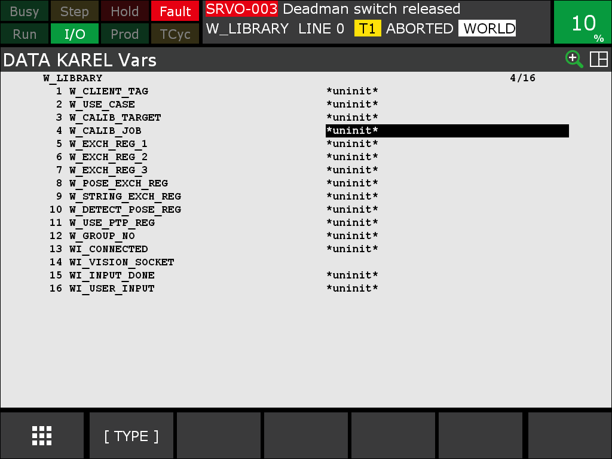
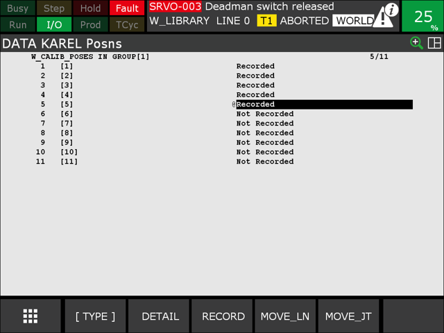
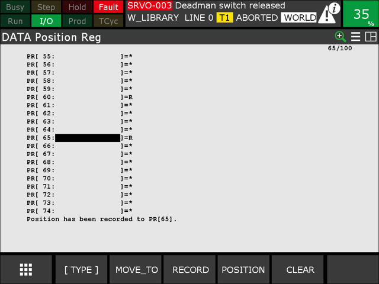

# 2. User Configuration

All parameters you need to adapt to your setup are KAREL variables of the `W_LIBRARY` program. Adjust them according to your needs before running the example.

To access the KAREL variables, select the corresponding PC file `W_LIBRARY`, then go to **Data → Type** (bottom bar) **→ Karel Vars**. The variables are the same for the `V9` and the `V10` file set.

<figure class="align-left">

</figure>

!!! note

    The variables are uninitialized until you run `W_LIBRARY` once. See [Installation & Setup → Initialize the KAREL variables](1_0_0_installation.md#initialize-the-karel-variables).

## User configurable KAREL variables

The following variables (prefix `w_`) can be adjusted under **Data → Karel Vars** after selecting the KAREL program `W_LIBRARY`.

/// html | div.col-widths
    attrs: {style: "--w1: 25%; --w2: 20%; --w3: 55%"}
| Variable | Default | Note |
| --- | --- | --- |
| `w_client_tag` | `C1:` | Host Comm client tag configured for the vision device (see [Socket messaging](1_0_0_installation.md#socket-messaging)). |
| `w_use_case` | `camera_on_robot` | Either `camera_on_robot` or `camera_not_on_robot`. |
| `w_calib_target` | `zvzj002` | ID of the calibration target: `zvzj001`, `zvzj002`, `zvzj003`, `zvzj004`, `24x30mm`, `375x550mm` or `550x800mm`. For a [ZVZJ005](https://www.wenglor.com/product/ZVZJ005) plate use `zvzj001`, for a [ZVZJ006](https://www.wenglor.com/product/ZVZJ006) plate use `zvzj002`. |
| `w_calib_job` | `calibration.u3p` | uniVision job for calibration. |
| `w_exch_reg_1` | `60` | Primary output register (R) for BOOLEAN / INTEGER / REAL. |
| `w_exch_reg_2` | `61` | Secondary output register (R). |
| `w_exch_reg_3` | `62` | Tertiary output register (R). |
| `w_pose_exch_reg` | `60` | Output pose register (PR). |
| `w_string_exch_reg` | `60` | Output string register (SR). |
| `w_detect_pose_reg` | `65` | Detection pose register (PR) — keep in sync with the PR referenced by the TP programs. |
| `w_use_ptp_reg` | `63` | Register (R) used to switch `W_MOVE` between PTP (`1`) and LIN (`0`). |
| `w_group_no` | `1` | Robot group number. |
| `w_tool_no` | `1` | Robot tool number used for initialization. It is passed to `R[64]`, which the TP programs apply with `UTOOL_NUM=R[64]`. See [Installation & Setup → Tool setup](1_0_0_installation.md#tool-setup). |
| `w_frame_no` | `0` | Robot user frame number used for initialization. It is passed to `R[65]`, which the TP programs apply with `UFRAME_NUM=R[65]`. |
///

!!! warning

    Variables with a `wi_` prefix are internal and **must not** be changed.

!!! warning

    `R[65]` (numeric register, user frame number) and `PR[65]` (position register, detection pose) are different registers despite the shared index. Changing one does not affect the other.

## Calibration poses (`W_CALIB_POSES`)

/// html | div.col-widths
    attrs: {style: "--w1: 25%; --w2: 75%;"}
| Variable | Note |
| --- | --- |
| `w_calib_poses` | Array of up to eleven XYZWPR calibration poses (minimum five required). Set under **Data → Karel Pos**. |
///

The KAREL library exchanges registers to write the results of the commands, and it writes `w_tool_no` and `w_frame_no` to `R[64]` and `R[65]` on start-up. Please check whether these registers conflict with your own register usage and change them if required.

## Set the calibration and detection poses

Set up a maximum of eleven calibration poses (at least five). Depending on the use case, the detection pose is handled differently:

- **Camera on robot:** The detection pose is set during calibration and is also used for validation.
- **Camera not on robot:** The detection pose must be set by the user. It also serves as the retreat pose after the calibration movement. During this movement you remove the calibration plate from the robot and place it on the object plane; the same pose is used for validation.
- **Both cases:** Set the detection pose in a global register. By default, pose register **65** (`PR[65]`) is used, as shown in the provided example programs `W_SINGLE_DETECT` and `W_MULTI_DETECT`.

Select the KAREL file `W_LIBRARY` → **Data → Karel Pos → W_CALIB_POSES**.

<figure class="align-left">

</figure>

Set the detection pose. By default, pose register `PR[65]` is used. If `PR[65]` is used for other purposes, you can pick another PR, but then you need to update the TP programs accordingly. If you change the detection pose register, also update the `w_detect_pose_reg` KAREL variable.

<figure class="align-left">

</figure>

!!! note

    For the general calibration concepts — which calibration target to use, how to choose and vary the poses, and how to read the reprojection error — see the [Wenglor Robot Server overview](https://wenglor.github.io/robot-vision-generic-string/5_1_0_basics_with_robot_server/) in the wenglor robot vision manual. They are not repeated here.
