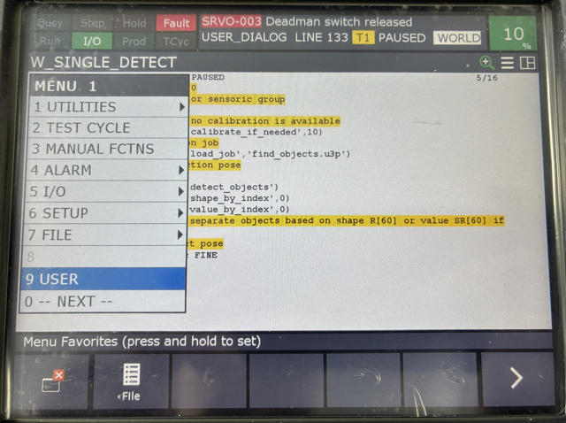
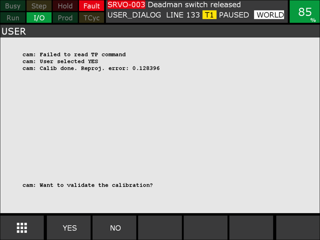
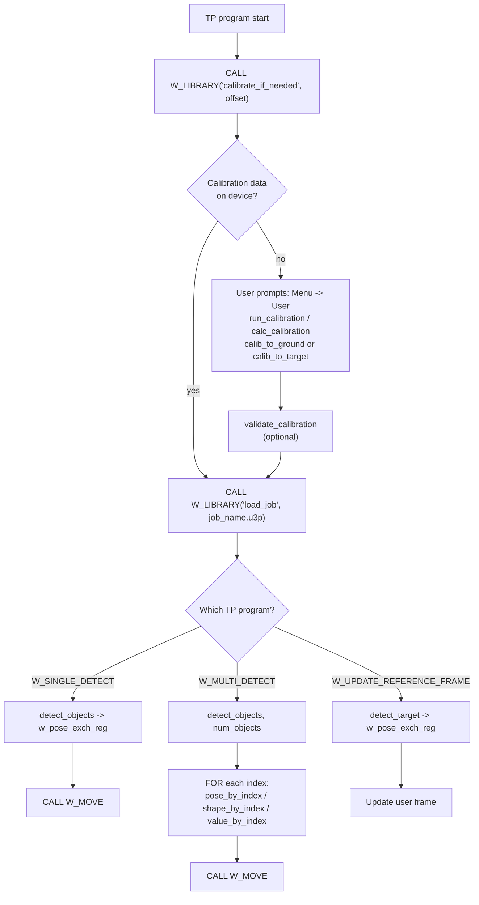
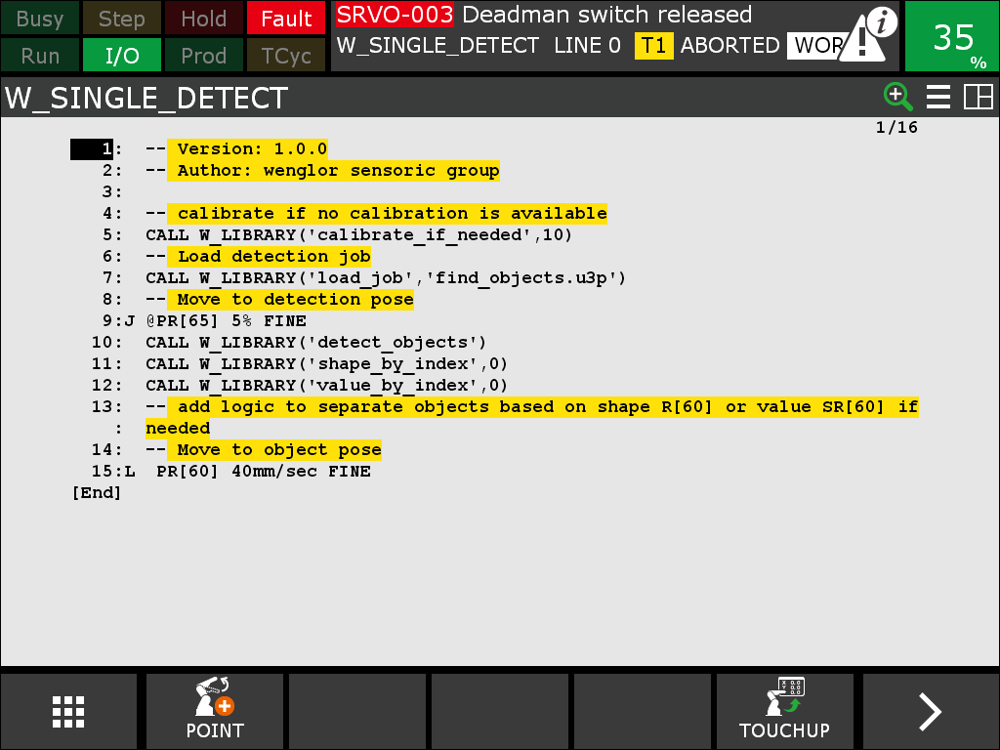

# 3. Robot Program

The example program implements a complete robot vision workflow: calibrating the camera to the robot, detecting objects, and moving to them. It is split into a KAREL backend (`W_LIBRARY`) that does the socket communication with the wenglor robot server, and TP programs that orchestrate the workflow.

## Exchange registers

These are the default registers used to return values from the KAREL routines. They are editable via the KAREL variables (select the `W_LIBRARY` program). See [User Configuration](2_0_0_user_configuration.md).

/// html | div.col-widths
    attrs: {style: "--w1: 10%; --w2: 25%; --w3: 65%"}
| Register | KAREL variable | Note |
| --- | --- | --- |
| `R[60]` | `w_exch_reg_1` | Used for single and multiple output routines. Can contain BOOLEAN, INTEGER and REAL. |
| `R[61]` | `w_exch_reg_2` | Only used if two or more outputs are required. Can contain BOOLEAN, INTEGER and REAL. |
| `R[62]` | `w_exch_reg_3` | Placeholder for routines with more than two outputs. Can contain BOOLEAN, INTEGER and REAL. |
| `PR[60]` | `w_pose_exch_reg` | Output pose, e.g. object pose or calibration target pose (validation). |
| `SR[60]` | `w_string_exch_reg` | Output string, e.g. additional value or current uniVision job name. |
///

## Callable KAREL routines

Call a routine with `CALL W_LIBRARY('<routine>' [, <arg>])`. The results are written to the exchange registers above.

/// html | div.col-widths
    attrs: {style: "--w1: 25%; --w2: 15%; --w3: 35%; --w4: 25%;"}
| Routine | Input | Example | Output |
| --- | --- | --- | --- |
| `cam_status` | — | `CALL W_LIBRARY('cam_status')` | `w_exch_reg_1`: `1` (calibration data found) or `0` (no calibration data). |
| `load_job` | 1. job name | `CALL W_LIBRARY('load_job','find_objects.u3p')` | — |
| `get_job` | — | `CALL W_LIBRARY('get_job')` | `w_string_exch_reg`: name of active uniVision job. |
| `clear_calib_buffer` | — | `CALL W_LIBRARY('clear_calib_buffer')` | — |
| `add_calib_pose` | — | `CALL W_LIBRARY('add_calib_pose')` | — |
| `calc_calibration` | — | `CALL W_LIBRARY('calc_calibration')` | `w_exch_reg_1`: reprojection error / accuracy of the intrinsic camera calibration. |
| `calib_to_ground` | — | `CALL W_LIBRARY('calib_to_ground')` | — |
| `calib_to_target` | — | `CALL W_LIBRARY('calib_to_target')` | — |
| `run_calibration` | — | `CALL W_LIBRARY('run_calibration')` | — |
| `validate_calibration` | 1. safety offset in mm (REAL) | `CALL W_LIBRARY('validate_calibration', 10.5)` | Moves the robot to the target for visual validation. |
| `calibrate_if_needed` | 1. safety offset in mm (REAL) | `CALL W_LIBRARY('calibrate_if_needed', 10.5)` | Runs a calibration only if no calibration data is present. |
| `detect_objects` | — | `CALL W_LIBRARY('detect_objects')` | `w_pose_exch_reg`: object pose at Result List index 0 of the uniVision `Device Robot Vision`. |
| `detect_target` | — | `CALL W_LIBRARY('detect_target')` | `w_pose_exch_reg`: calibration target pose. |
| `num_objects` | — | `CALL W_LIBRARY('num_objects')` | `w_exch_reg_1`: number of found objects. |
| `pose_by_index` | 1. index of object | `CALL W_LIBRARY('pose_by_index',R[11])` | `w_pose_exch_reg`: object pose for the given index. |
| `shape_by_index` | 1. index of object | `CALL W_LIBRARY('shape_by_index',R[11])` | `w_exch_reg_1`: shape model ID for the object with the given index. |
| `value_by_index` | 1. index of object | `CALL W_LIBRARY('value_by_index',R[11])` | `w_string_exch_reg`: additional value for the object with the given index. |
///

!!! note

    The KAREL routines are thin wrappers around the generic string based robot vision API. For the underlying commands, return values, and error codes, see the [Generic Robot Vision API](https://wenglor.github.io/robot-vision-generic-string/5_6_0_generic_robot_vision_api/) in the wenglor robot vision manual.

!!! note

    `detect_target` and `calib_to_target` wrap the `target:pose` and `calibration:target` commands, used to detect a calibration target's pose or recalibrate the camera-to-target relation without writing a new calibration file (e.g. for mobile platforms, see `W_UPDATE_REFERENCE_FRAME` below). See [Target Pose and Camera-to-Target Calibration](https://wenglor.github.io/robot-vision-generic-string/5_5_0_target_pose_and_camera_to_target/) in the wenglor robot vision manual.

## Units and conventions

The generic robot vision API uses the following conventions, which the KAREL library maps to the FANUC representation:

- Positions `x, y, z` are exchanged in **meters**; FANUC works in **millimeters**.
- Orientations `rx, ry, rz` are exchanged as a **rotation vector** (Rodrigues convention, in radians); FANUC uses **W, P, R** Euler angles.

See the command tables in the [Generic Robot Vision API](https://wenglor.github.io/robot-vision-generic-string/5_6_0_generic_robot_vision_api/) in the wenglor robot vision manual.

## Program structure

/// html | div.col-widths
    attrs: {style: "--w1: 35%; --w2: 65%;"}
| File | Responsibility |
| --- | --- |
| `w_library.pc` | KAREL library. Socket communication with the robot server, calibration, detection, pose conversions, error handling, and all user-adjustable variables. See [User Configuration](2_0_0_user_configuration.md). |
| `w_single_detect.tp` | Calibrates if needed, loads the detection job, moves to the detection pose, detects a single object and moves to it. |
| `w_multi_detect.tp` | Fills the buffer, reads the number of objects, and iterates over all detected objects. |
| `w_update_reference_frame.tp` | Detects the calibration target and updates a reference frame (e.g. for mobile platforms). |
| `w_move.tp` | Helper that moves the robot to the exchange pose register, PTP or LIN depending on `w_use_ptp_reg`. |
///

The KAREL backend takes TP call parameters as **inputs** and returns its values to **global registers**.

## Calibration and validation process

If no calibration file is available on the Machine Vision Device, the example program starts the calibration process automatically. Select either `W_SINGLE_DETECT`, `W_MULTI_DETECT`, or `W_UPDATE_REFERENCE_FRAME` to run it.

The calibration process uses **user prompts**. To see them, go to **Menu → User**.

<figure class="align-left">

</figure>

Use **SHIFT + F1** to answer `YES` and **SHIFT + F2** to answer `NO`. The program must be active so it can read the input, so in total **Deadman switch + SHIFT + F1 (or F2)** must be pressed at the same time.

The program returns the registered user input. After this, the calibration movement starts. When the calibration is done, the reprojection error is returned.

<figure class="align-left">

</figure>

For the optional validation, the robot first moves to the detection pose as a safe retreat pose, then moves to the bottom-left corner of the calibration plate. By default, a safety offset is applied (adjustable via the TP call argument), so the robot moves *above* the calibration plate.

!!! note

    For what a good calibration looks like (Z-axis orientation, expected reprojection error values), see the [Wenglor Robot Server overview](https://wenglor.github.io/robot-vision-generic-string/5_1_0_basics_with_robot_server/) in the wenglor robot vision manual.

### Camera on robot

The detection pose is set during the calibration and is also used for the validation. Teach a minimum of five calibration poses (seven to eleven for better accuracy).

### Camera not on robot

The detection pose must be set by the user (see [User Configuration](2_0_0_user_configuration.md#set-the-calibration-and-detection-poses)). It also serves as the retreat pose after the calibration movement. During this movement you remove the calibration plate from the robot and place it on the object plane; the same pose is used for validation.

## TP programs

Set up your TP program with the KAREL routines described in [Callable KAREL routines](#callable-karel-routines). You can also use the provided example programs `W_SINGLE_DETECT`, `W_MULTI_DETECT` or `W_UPDATE_REFERENCE_FRAME`.



<!-- W_SINGLE_DETECT TP program listing on the teach pendant -->
<figure class="align-left">

</figure>

### `W_SINGLE_DETECT`

Calibrates if no calibration data is available, loads the detection job, moves to the detection pose, requests a single object pose, and moves to it:

```
  ! Calibrate if no calibration data is available
  CALL W_LIBRARY('calibrate_if_needed', 10.5)
  ! Load detection job
  CALL W_LIBRARY('load_job','find_objects.u3p')
  ! Move to detection pose PR[65]
  ...
  ! Detect a single object; the pose is returned in PR[60]
  CALL W_LIBRARY('detect_objects')
  ! Move to the detected object
  CALL W_MOVE
```

### `W_MULTI_DETECT`

Calibrates if needed, loads the detection job, moves to the detection pose, fills the camera-side buffer, reads the number of objects, and iterates over all detected objects:

```
  CALL W_LIBRARY('calibrate_if_needed', 10.5)
  CALL W_LIBRARY('load_job','find_objects.u3p')
  ...
  ! Fill the buffer with a detection
  CALL W_LIBRARY('detect_objects')
  ! Read the number of objects into R[60]
  CALL W_LIBRARY('num_objects')
  ! Abort if no object was found
  IF R[60]=0, JMP LBL[...]
  ! Iterate over all objects (the vision API index is 0-based)
  FOR R[2]=0 TO (R[60]-1)
    CALL W_LIBRARY('pose_by_index',R[2])
    ! Optionally read the shape model / additional value
    CALL W_LIBRARY('shape_by_index',R[2])
    CALL W_LIBRARY('value_by_index',R[2])
    CALL W_MOVE
  ENDFOR
```

You can extend this with conditional checks on the shape model or the additional value (link the additional value in the uniVision `Device Robot Vision` before using `value_by_index`).

### `W_UPDATE_REFERENCE_FRAME`

Used for mobile platforms and similar use cases (e.g. correcting positional deviations of a mobile platform in front of a machine or shelf). It calibrates if needed, loads the target-detection job, detects the calibration target, and updates a user frame that your machine poses are taught relative to.

```
  CALL W_LIBRARY('calibrate_if_needed', 10.5)
  ! Load find_target job, as it detects the reference frame
  CALL W_LIBRARY('load_job','find_target.u3p')
  ! Detect the calibration target; the pose is returned in PR[60]
  CALL W_LIBRARY('detect_target')
  ! Update the user frame with the detected pose, then move to the taught machine poses
  ...
```

On the first run, set/teach the machine poses relative to the updated reference frame, then re-run the program.

!!! note

    You may want to use a dedicated user frame for this use case. Replace the placeholder machine poses with your own.

### `W_MOVE`

Helper program that moves the robot to the exchange pose register (`PR[60]` by default). It checks whether PTP is enabled via the register configured in `w_use_ptp_reg` (default `R[63]`): `1` → PTP (joint) motion, `0` → LIN (linear) motion.
