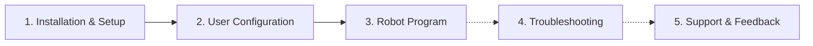

# FANUC Robots Vision Manual

> NOTE
>
> This manual focuses exclusively on FANUC Robots-specific topics. For general robot vision information, please refer to the [wenglor robot vision manual](https://wenglor.github.io/robot-vision-generic-string/).

This repository contains an example FANUC program to set up and start the generic vision interface to wenglor Machine Vision Devices on your FANUC robot.

The robot vision example for FANUC consists of the following files, available in the [`sources`](https://github.com/wenglor/robot-vision-fanuc/tree/main/sources) directory of this repository:

| File | Description |
| --- | --- |
| `w_library.pc` | KAREL library with all vision routines (socket communication, calibration, detection, conversions). |
| `w_single_detect.tp` | Single object detection TP program. |
| `w_multi_detect.tp` | Multiple object detection TP program. |
| `w_update_reference_frame.tp` | Reference-frame update TP program. |
| `w_move.tp` | Helper TP program that moves the robot to a pose register (PTP or LIN). |

> NOTE
>
> - Tested with the **FANUC R-30iB Mate Plus** robot controller running software **V9.40** and the **LR Mate 200iD** robot arm. Make sure to use the same software version on your FANUC robot controller.
> - Working with KAREL files requires the system variable `$KAREL_ENB` to be set to `1`.

---

## How the manual is organized

1. [Installation & Setup](1_0_installation/index.md) — prepare the controller, network, and tool frame, then transfer the files.
2. [User Configuration](2_0_user_configuration/index.md) — adjust the KAREL variables and poses to your setup.
3. [Robot Program](3_0_robot_program/index.md) — how the KAREL library and TP programs work together.
4. [Troubleshooting](4_0_troubleshooting/index.md) — common issues and how to resolve them.
5. [Support & Feedback](5_0_support_and_feedback/index.md) — where to report bugs or suggest features.

> NOTE
>
> The generic robot vision API (commands, return values, error codes), the calibration guidelines, and the uniVision job setup are documented once in the [wenglor robot vision manual](https://wenglor.github.io/robot-vision-generic-string/4_0_robot_vision_server/) and are **not** repeated here. This manual only describes how the FANUC example uses them.
